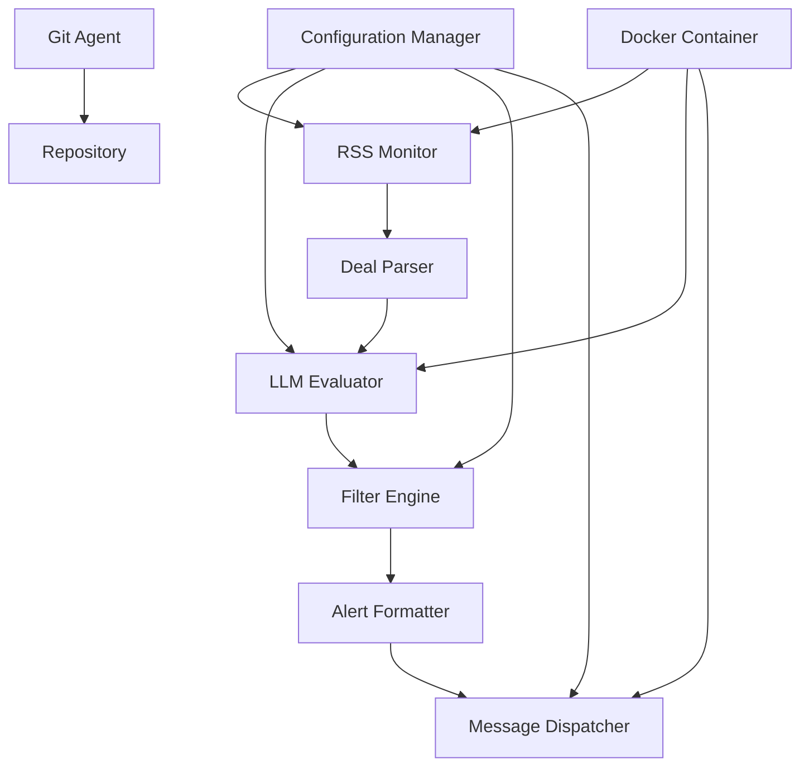

# Design Document

## Overview

The OzBargain Deal Filter & Alert System is a Python-based application that monitors RSS feeds, evaluates deals using LLM integration, and delivers filtered alerts through messaging platforms. The system follows a modular architecture with clear separation of concerns, containerized deployment, and configurable components for flexibility and maintainability.

## Architecture

### High-Level Architecture



### Component Architecture

The system consists of six core components:

1. **RSS Monitor**: Polls configured feeds and detects new deals
2. **Deal Parser**: Extracts structured data from RSS entries
3. **LLM Evaluator**: Applies prompt templates to assess deal relevance
4. **Filter Engine**: Applies price thresholds and authenticity checks
5. **Alert Formatter**: Creates rich notifications with deal information
6. **Message Dispatcher**: Delivers alerts via selected messaging platform

### Technical Discovery Requirements

Before implementation, the design phase must include:

1. **Messaging Platform Research**: Test APIs for WhatsApp Business, Telegram Bot, Discord webhooks, and Slack webhooks
2. **RSS Feed Analysis**: Analyze OzBargain RSS structure and rate limits
3. **LLM Integration Testing**: Validate local Docker models (Ollama) vs API services (OpenAI, Anthropic)
4. **Authentication Methods**: Test messaging platform authentication and setup complexity

## Components and Interfaces

### RSS Monitor Component

**Purpose**: Continuously monitor configured RSS feeds for new deals

**Key Classes**:
- `RSSMonitor`: Main monitoring orchestrator
- `FeedPoller`: Individual feed polling logic
- `DealDetector`: Identifies new deals since last check

**Interfaces**:
```python
class IRSSMonitor(Protocol):
    def start_monitoring(self) -> None: ...
    def stop_monitoring(self) -> None: ...
    def add_feed(self, feed_url: str) -> bool: ...
    def remove_feed(self, feed_url: str) -> bool: ...

class IDealDetector(Protocol):
    def detect_new_deals(self, feed_data: str) -> List[RawDeal]: ...
```

**Dependencies**: `feedparser` library for RSS parsing, `requests` for HTTP operations

### Deal Parser Component

**Purpose**: Convert raw RSS entries into structured deal objects

**Key Classes**:
- `DealParser`: Main parsing logic
- `DealValidator`: Validates parsed deal data
- `PriceExtractor`: Extracts price and discount information

**Interfaces**:
```python
class IDealParser(Protocol):
    def parse_deal(self, raw_deal: RawDeal) -> Deal: ...
    def validate_deal(self, deal: Deal) -> bool: ...

@dataclass
class Deal:
    title: str
    description: str
    price: Optional[float]
    original_price: Optional[float]
    discount_percentage: Optional[float]
    category: str
    url: str
    timestamp: datetime
    votes: Optional[int]
    comments: Optional[int]
```

### LLM Evaluator Component

**Purpose**: Evaluate deals against user criteria using configurable prompt templates

**Key Classes**:
- `LLMEvaluator`: Main evaluation orchestrator
- `PromptManager`: Loads and manages prompt templates
- `LocalLLMClient`: Interface for Docker-hosted models
- `APILLMClient`: Interface for external API services

**Interfaces**:
```python
class ILLMEvaluator(Protocol):
    def evaluate_deal(self, deal: Deal, prompt_template: str) -> EvaluationResult: ...
    def set_llm_provider(self, provider: LLMProvider) -> None: ...

@dataclass
class EvaluationResult:
    is_relevant: bool
    confidence_score: float
    reasoning: str
```

**LLM Provider Options**:
- **Local Docker**: Ollama with models like Llama 2, Mistral
- **API Services**: OpenAI GPT-3.5/4, Anthropic Claude, Google Gemini

### Filter Engine Component

**Purpose**: Apply price thresholds, discount criteria, and authenticity assessment

**Key Classes**:
- `FilterEngine`: Main filtering orchestrator
- `PriceFilter`: Applies price and discount thresholds
- `AuthenticityAssessor`: Evaluates deal authenticity using community data

**Interfaces**:
```python
class IFilterEngine(Protocol):
    def apply_filters(self, deal: Deal, evaluation: EvaluationResult) -> FilterResult: ...

@dataclass
class FilterResult:
    passes_filters: bool
    price_match: bool
    authenticity_score: float
    urgency_level: UrgencyLevel
```

### Alert Formatter Component

**Purpose**: Create rich, actionable alert messages

**Key Classes**:
- `AlertFormatter`: Main formatting logic
- `MessageTemplate`: Template management for different platforms
- `UrgencyCalculator`: Determines alert urgency

**Interfaces**:
```python
class IAlertFormatter(Protocol):
    def format_alert(self, deal: Deal, filter_result: FilterResult) -> FormattedAlert: ...

@dataclass
class FormattedAlert:
    title: str
    message: str
    urgency: UrgencyLevel
    platform_specific_data: Dict[str, Any]
```

### Message Dispatcher Component

**Purpose**: Deliver alerts via selected messaging platform

**Key Classes**:
- `MessageDispatcher`: Main dispatch orchestrator
- `TelegramDispatcher`: Telegram Bot API integration
- `WhatsAppDispatcher`: WhatsApp Business API integration
- `DiscordDispatcher`: Discord webhook integration

**Interfaces**:
```python
class IMessageDispatcher(Protocol):
    def send_alert(self, alert: FormattedAlert) -> DeliveryResult: ...
    def test_connection(self) -> bool: ...

@dataclass
class DeliveryResult:
    success: bool
    delivery_time: datetime
    error_message: Optional[str]
```

## Data Models

### Core Data Models

```python
@dataclass
class RawDeal:
    """Raw deal data from RSS feed"""
    title: str
    description: str
    link: str
    pub_date: str
    category: Optional[str] = None

@dataclass
class Deal:
    """Parsed and structured deal data"""
    id: str
    title: str
    description: str
    price: Optional[float]
    original_price: Optional[float]
    discount_percentage: Optional[float]
    category: str
    url: str
    timestamp: datetime
    votes: Optional[int]
    comments: Optional[int]
    urgency_indicators: List[str]

@dataclass
class UserCriteria:
    """User filtering criteria"""
    prompt_template_path: str
    max_price: Optional[float]
    min_discount_percentage: Optional[float]
    categories: List[str]
    keywords: List[str]
    min_authenticity_score: float

@dataclass
class Configuration:
    """System configuration"""
    rss_feeds: List[str]
    user_criteria: UserCriteria
    llm_provider: LLMProviderConfig
    messaging_platform: MessagingPlatformConfig
    polling_interval: int
    max_concurrent_feeds: int
```

### Configuration Schema

```yaml
# config.yaml
rss_feeds:
  - "https://www.ozbargain.com.au/deals/feed"
  - "https://www.ozbargain.com.au/cat/computing/feed"

user_criteria:
  prompt_template: "prompts/deal_evaluator.txt"
  max_price: 500.0
  min_discount_percentage: 20.0
  categories: ["Computing", "Electronics"]
  min_authenticity_score: 0.6

llm_provider:
  type: "local"  # or "api"
  local:
    model: "llama2"
    docker_image: "ollama/ollama"
  api:
    provider: "openai"
    api_key: "${OPENAI_API_KEY}"
    model: "gpt-3.5-turbo"

messaging_platform:
  type: "telegram"  # Selected after technical discovery
  telegram:
    bot_token: "${TELEGRAM_BOT_TOKEN}"
    chat_id: "${TELEGRAM_CHAT_ID}"

system:
  polling_interval: 120  # seconds
  max_concurrent_feeds: 10
  alert_timeout: 300  # 5 minutes for regular deals
  urgent_alert_timeout: 120  # 2 minutes for urgent deals
```

## Error Handling

### Error Categories and Strategies

1. **RSS Feed Errors**:
   - Network timeouts: Retry with exponential backoff
   - Invalid feed format: Log error, continue with other feeds
   - Rate limiting: Respect limits, adjust polling frequency

2. **LLM Evaluation Errors**:
   - API failures: Fall back to keyword-based filtering
   - Local model unavailable: Switch to API provider if configured
   - Timeout errors: Skip deal evaluation, log for review

3. **Messaging Platform Errors**:
   - API unavailable: Queue alerts for retry
   - Authentication failures: Log error, notify administrator
   - Rate limiting: Implement message queuing with delays

4. **Configuration Errors**:
   - Invalid config file: Fail fast with clear error messages
   - Missing credentials: Provide setup instructions
   - Invalid prompt templates: Use default template, log warning

### Logging Strategy

```python
import logging
from enum import Enum

class LogLevel(Enum):
    DEBUG = "DEBUG"
    INFO = "INFO"
    WARNING = "WARNING"
    ERROR = "ERROR"
    CRITICAL = "CRITICAL"

# Structured logging for monitoring and debugging
logger = logging.getLogger("ozb_deal_filter")
logger.setLevel(logging.INFO)

# Log categories:
# - rss.monitor: RSS feed monitoring events
# - llm.evaluation: LLM evaluation results and errors
# - filter.engine: Filtering decisions and results
# - alert.delivery: Message delivery status and errors
# - git.automation: Automated commit operations
```

## Testing Strategy

### Unit Testing

- **Component Testing**: Each component tested in isolation with mocks
- **Interface Testing**: Verify all protocol implementations
- **Data Model Testing**: Validate serialization/deserialization
- **Configuration Testing**: Test config loading and validation

### Integration Testing

- **RSS Feed Integration**: Test with real OzBargain feeds (respecting rate limits)
- **LLM Integration**: Test both local and API providers
- **Messaging Platform Integration**: Test alert delivery to real platforms
- **End-to-End Testing**: Complete workflow from RSS to alert delivery

### Performance Testing

- **Feed Polling Performance**: Measure processing time for multiple feeds
- **LLM Evaluation Performance**: Benchmark local vs API response times
- **Memory Usage**: Monitor resource consumption during continuous operation
- **Alert Delivery Latency**: Measure time from deal detection to alert delivery

### Test Environment Setup

```python
# pytest configuration for testing
# tests/conftest.py
import pytest
from unittest.mock import Mock

@pytest.fixture
def mock_rss_feed():
    return """<?xml version="1.0"?>
    <rss version="2.0">
        <channel>
            <item>
                <title>Test Deal - 50% off Electronics</title>
                <description>Great deal on electronics</description>
                <link>https://example.com/deal</link>
                <pubDate>Mon, 01 Jan 2024 12:00:00 GMT</pubDate>
            </item>
        </channel>
    </rss>"""

@pytest.fixture
def mock_llm_evaluator():
    evaluator = Mock()
    evaluator.evaluate_deal.return_value = EvaluationResult(
        is_relevant=True,
        confidence_score=0.8,
        reasoning="Matches user criteria for electronics deals"
    )
    return evaluator
```

### Git Automation Testing

- **Commit Message Generation**: Verify meaningful commit messages
- **File Staging**: Test automatic staging of modified files
- **Branch Management**: Ensure commits go to correct branch
- **Error Handling**: Test git operation failures and recovery

## Technical Discovery Plan

### Phase 1: Messaging Platform Research

**Platforms to Evaluate**:
1. **Telegram Bot API**
   - Test bot creation and message sending
   - Evaluate rate limits and message formatting options
   - Assess setup complexity and documentation quality

2. **WhatsApp Business API**
   - Research free tier limitations
   - Test message delivery and formatting
   - Evaluate authentication requirements

3. **Discord Webhooks**
   - Test webhook creation and message posting
   - Evaluate rich embed support for deal information
   - Assess rate limits and reliability

4. **Slack Webhooks**
   - Test incoming webhook setup
   - Evaluate message formatting and attachment support
   - Assess ease of setup for end users

**Evaluation Criteria**:
- Setup complexity (1-10 scale)
- Message formatting capabilities
- Rate limits and reliability
- Free tier limitations
- Mobile notification quality

### Phase 2: RSS Feed Analysis

**OzBargain RSS Research**:
- Analyze feed structure and available data fields
- Test polling frequency limits
- Identify urgency indicators in feed data
- Document vote/comment data availability

### Phase 3: LLM Integration Testing

**Local Options**:
- Test Ollama Docker setup on Windows 11
- Benchmark Llama 2, Mistral, and CodeLlama models
- Measure response times and resource usage

**API Options**:
- Test OpenAI GPT-3.5-turbo and GPT-4 APIs
- Evaluate Anthropic Claude API
- Compare cost per evaluation and response quality

## Implementation Notes

### Docker Configuration

```dockerfile
# Dockerfile
FROM python:3.11-slim

WORKDIR /app

COPY requirements.txt .
RUN pip install --no-cache-dir -r requirements.txt

COPY . .

CMD ["python", "-m", "ozb_deal_filter.main"]
```

```yaml
# docker-compose.yml
version: '3.8'
services:
  ozb-deal-filter:
    build: .
    volumes:
      - ./config:/app/config
      - ./prompts:/app/prompts
      - ./logs:/app/logs
    environment:
      - CONFIG_PATH=/app/config/config.yaml
    restart: unless-stopped

  ollama:
    image: ollama/ollama
    ports:
      - "11434:11434"
    volumes:
      - ollama_data:/root/.ollama
    restart: unless-stopped

volumes:
  ollama_data:
```

### Development Workflow

1. **PEP 8 Compliance**: Use `black`, `flake8`, and `mypy` for code quality
2. **Git Automation**: Implement pre-commit hooks and automated commits
3. **Testing**: Maintain >90% test coverage with pytest
4. **Documentation**: Use Sphinx for API documentation generation
